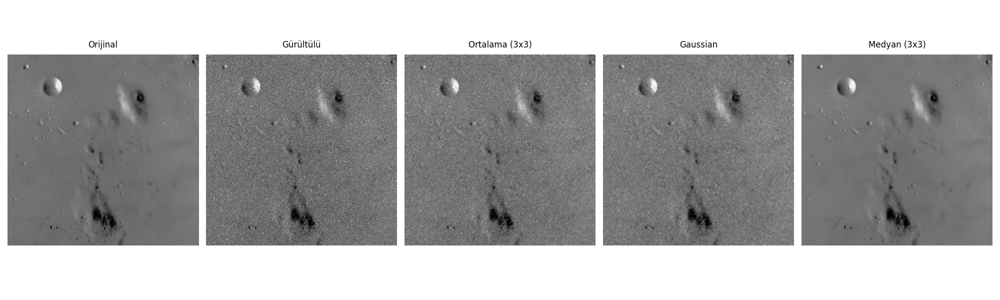
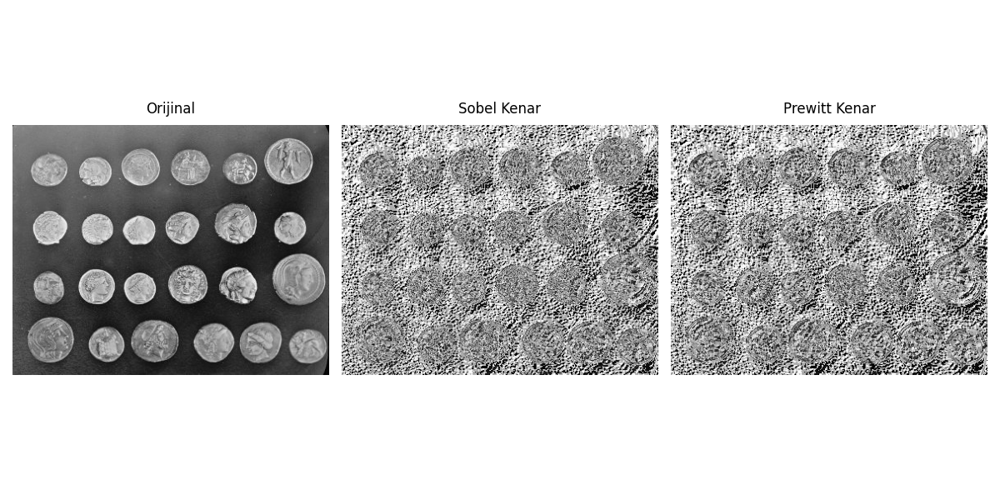
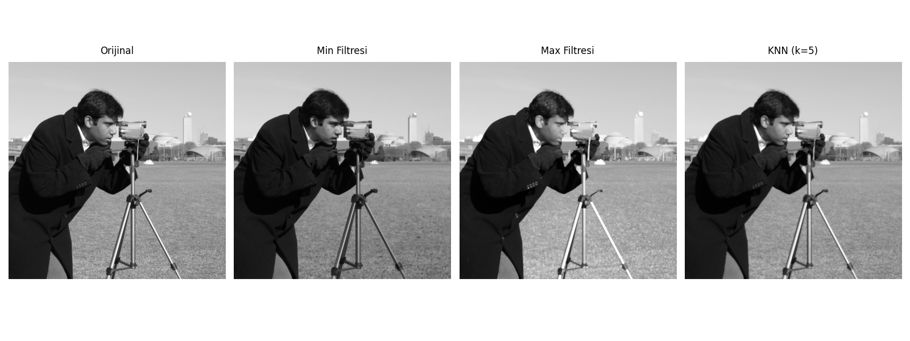

# Görüntü İşleme Ödevi: Filtreleme Uygulamaları

Bu rapor, ders kapsamında anlatılan uzaysal (spatial) filtreleme tekniklerinin örnek görüntüler üzerindeki uygulamalarını içermektedir.

## 1. Uygulanan Filtreler ve Teknik Detaylar

### Lineer Filtreler
- **Ortalama (Average) Filtresi**: 3x3 boyutundaki maske ile piksellerin ortalaması alınarak görüntüdeki gürültü azaltılmaya çalışılmıştır. Görüntüde genel bir bulanıklık (blur) oluştuğu gözlemlenmiştir.
- **Gaussian Filtresi**: Normal dağılım ağırlıklı bir yumuşatma yapılmıştır. Ortalama filtreye göre kenarları biraz daha iyi korumuştur.
- **Sobel ve Prewitt Filtreleri**: Gradyan tabanlı bu filtreler, görüntüdeki gri seviye geçişlerini (kenarları) vurgulamak için kullanılmıştır.

### Non-Lineer Filtreler
- **Median (Medyan) Filtresi**: Tuz-biber gürültüsünü (salt-and-pepper noise) temizlemek için en etkili yöntem olduğu doğrulanmıştır.
- **Min ve Max Filtreleri**: Görüntüdeki en karanlık ve en parlak noktaları vurgulayarak morfolojik aşındırma ve genişletme etkileri yaratmıştır.
- **K-En Yakın Komşu (K-NN)**: Merkezi piksele değerce en yakın komşuların ortalamasını alarak, kenar keskinliğini koruyan bir yumuşatma sağlamıştır.

## 2. Sonuç Görüntüleri ve Yorumlar

### Yumuşatma ve Gürültü Azaltma

*Yorum: Medyan filtresi gürültüyü tamamen temizlerken, lineer filtreler (Ortalama ve Gaussian) gürültü piksellerini görüntüye yayarak bulanıklığa neden olmuştur.*

### Kenar Belirleme

*Yorum: Sobel filtresi gradyan farklarını daha net belirginleştirmiş, madeni paraların sınırları doğrusal gradyanlar şeklinde ortaya çıkmıştır.*

### Non-Lineer İşlemler

*Yorum: Min filtresi görüntüyü koyulaştırırken (karanlık piksellerin baskılanması), Max filtresi aydınlık kısımları genişletmiştir. KNN ise detayı koruyan bir sonuç vermiştir.*

## 3. Kaynak Kodlar
Implementasyon Python (Numpy, Scipy, Scikit-image, Matplotlib) kullanılarak yapılmıştır.

**Uygulama Adımları:**
1. Görüntüler `skimage.data` modülünden yüklendi.
2. Özel `filters_utils.py` modülü ile filtreler uygulandı.
3. Sonuçlar `matplotlib` ile görselleştirilip kaydedildi.
